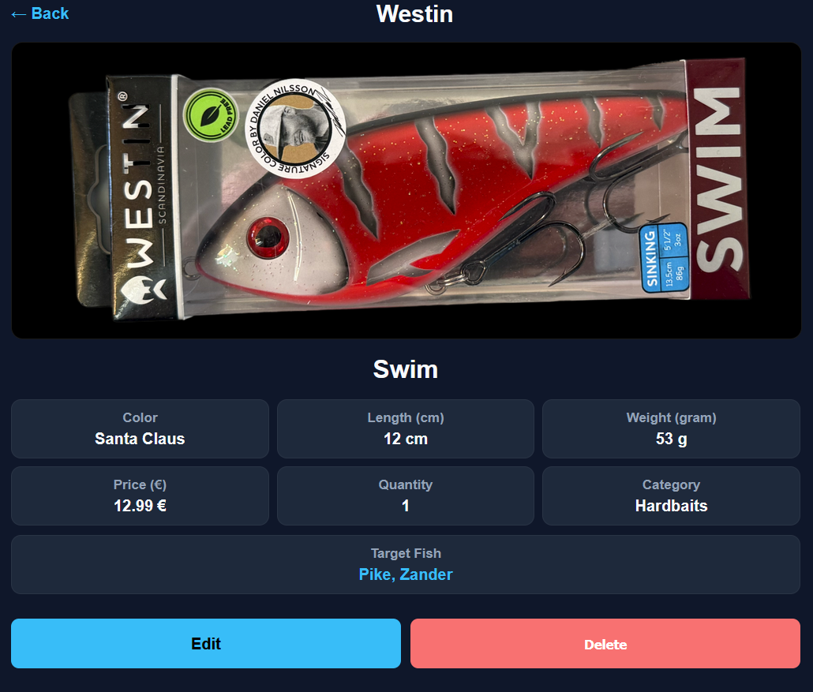
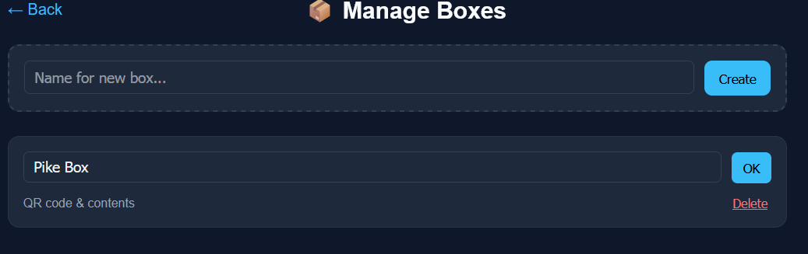

🎣 TackleBox Pro

🎣 TackleBox Pro

TackleBox Pro is a lightweight, self-hosted, web-based inventory system for anglers.
It helps you manage lures, rods, reels, and accessories in a clean and structured way — giving you a fast overview of your gear, total value, and detailed statistics at all times.

Designed for anglers who want full control over their data, without cloud services or heavy frameworks.

🚀 Features
📦 Visual Inventory

Modern grid-based layout with image previews

Optional list view for compact browsing

Mobile-friendly and responsive UI

🗂 Category Management

Categories for hardbaits, softbaits, rods, reels, hooks, accessories, and more

Category filter bar with instant switching

Default bait-focused start view

📊 Real-Time Statistics

Live display of:

Total item count

Total inventory value (€)

Statistics update dynamically per category

🔍 Smart & Cross-Language Search

Live search by:

Brand

Model

Color

Target fish

Language-aware search
(English search terms also match German data and vice versa)

🐟 Target Fish Tracking

Assign lures to specific target fish
(e.g. pike, zander, perch, trout)

Multi-select with visual chips

Automatically translated between languages

📦 Box System (Storage Management)

Create, rename, and delete boxes

Assign items to boxes

Instant box assignment dropdown in item detail view

Select a box → item is assigned immediately

Select “No box” → item is removed instantly

Dedicated box content view

Remove items directly from boxes

Automatic cleanup when a box is deleted

🔳 QR Codes for Boxes

Each box has its own QR code

QR code links directly to the box contents in the app

Optimized print layout for physical box labels

🖼 Lightbox Detail View

Click any image to view it full-screen

Clean, distraction-free image preview

💾 Data Export & Import

Full backup as ZIP archive

SQLite database

All uploaded images

One-click export & restore

Safe restore handling
_________________________________________________________________________________________________________****

🛠 Technical Overview
Area	Technology
Backend	PHP (no framework)
Database	SQLite
Frontend	HTML, CSS, JavaScript
Design	Responsive, Dark / Light Mode
Security	CSRF protection, sessions, password hashing
Performance	Lazy loading (infinite scroll)

No external database or cloud services required — ideal for self-hosting.

_________________________________________________________________________________________________________
⚙️ Installation (Proxmox)

Open the Proxmox console

Paste the following command and press Enter:

bash -c "$(curl -sL https://raw.githubusercontent.com/JoeCoooool/tacklebox/main/setup.sh | tr -d '\r')"

The setup script will handle:

Installation of all dependencies

SQLite database setup

Deployment of the web application
_________________________________________________________________________________________________________

🔐 Security

Protected admin area

CSRF tokens on all critical actions

Secure password hashing

Hardened session handling

Brute-force login protection

🎯 Target Audience

Hobby and professional anglers

Tackle collectors

Anglers with large lure and gear inventories

Self-hosting enthusiasts
📸 Screenshots

